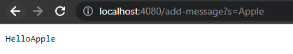
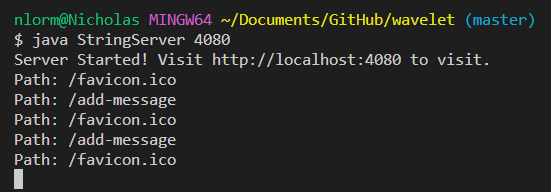
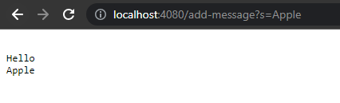

# Debugging Scenario
## What environment are you using (computer, operating system, web browser, terminal/editor, and so on)?  
I am using a Windows computer and code in VSCode. I view the server from Google Chrome.  
  
## Detail the symptom you’re seeing. Be specific; include both what you’re seeing and what you expected to see instead. Screenshots are great, copy-pasted terminal output is also great. Avoid saying “it doesn’t work”.  
For lab report 2, my server works fine when I add a singular word, however when I add another word after the first, the two words group together. Instead I expected for the two words to be separated by a line, similar to how the enter key works.  
  
  
  
## Detail the failure-inducing input and context. That might mean any or all of the command you’re running, a test case, command-line arguments, working directory, even the last few commands you ran. Do your best to provide as much context as you can.  
The two commands I used in the terminal were `javac Server.java StringServer.java` and `java NumberServer 4080`. Once the server was running, the two searches I used in Google Chrome were `http://localhost:4080/add-message?s=Hello` and `http://localhost:4080/add-message?s=Apple`.  

## TA Response:  
When your code adds a new word using the `/add-message?s=<string>` request, does it only add a new word or does it also add a `"\n"` to the output string? Understand that when adding words to a string, Java assumes that they will all be in line, so to differentiate between lines, you must add a `"\n"` whenever you want a line break.  

## Student Reponse:  
Thank you for the suggestion, the bug seemed to be exactly what you assumed. Once I added a `"\n"` after any words added, each entry separated itself. Thank you!  
  

## Setup  
* The file & directory structure needed  
  * https://github.com/ucsd-cse15l-f22/wavelet  
  * One more file added with name:  StringServer.java  
* The contents of each file *before* fixing the bug  
  * All original files from wavelet were kept the same  
  * StringServer.java had such code:  
  
```
import java.io.IOException;
import java.net.URI;

class Handler implements URLHandler {
    String str = "";

    public String handleRequest(URI url) {
        if (url.getPath().equals("/")) {
            return str;
        } 
        else {
            System.out.println("Path: " + url.getPath());
            if (url.getPath().contains("/add-message")){
                String[] parameters = url.getQuery().split("=");
                if (parameters[0].equals("s")) {
                    str += parameters[1];
                    return str;
                }
            }
            return "404 Not Found";
        }
    }
}

class StringServer {
    public static void main(String[] args) throws IOException {
        if(args.length == 0){
            System.out.println("Missing port number! Try any number between 1024 to 49151");
            return;
        }

        int port = Integer.parseInt(args[0]);

        Server.start(port, new Handler());
    }
}
```  
* The full command line (or lines) you ran to trigger the bug  
  * `javac Server.java StringServer.java`  
  * `java StringServer 4080`  
  * `http://localhost:4080/add-message?s=Hello` (Search in Chrome)  
  * `http://localhost:4080/add-message?s=Apple` (Search in Chrome)  
* A description of what to edit to fix the bug  
  * Added `"\n"` to output string when a word was added  

## Reflection  
Something I learned from the labs in the second half of my quarter is that I have to understand that not everyone has the same conditions as me when running code. If I want to create code for multiple different environments I have to test I different environments before I should feel satisfied with my work. However on the other hand, with all the difficult and strage code I've been making throughout the labs, I have learned to understand that as long as it's an application that only I will see and is designed specifically for me, I can feel ok with code that has many bugs and holes, as long as understand the codes limitations and work around them.
